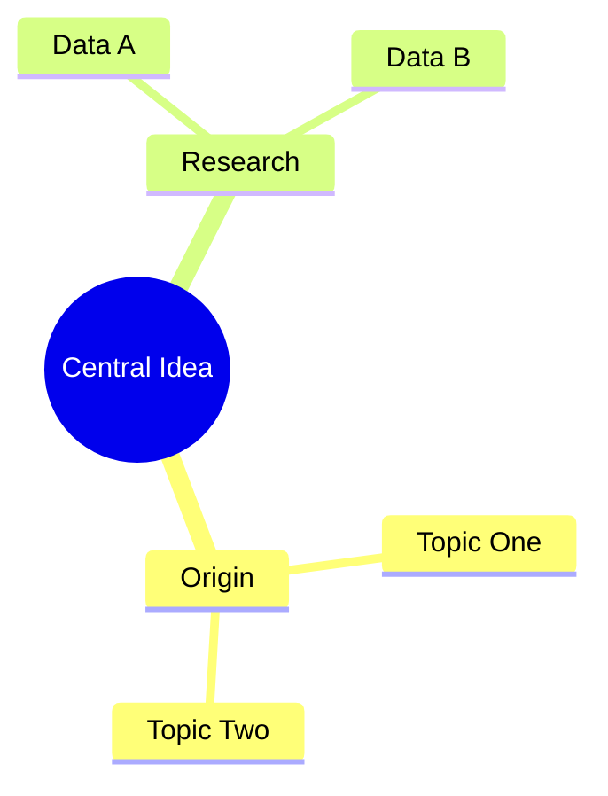
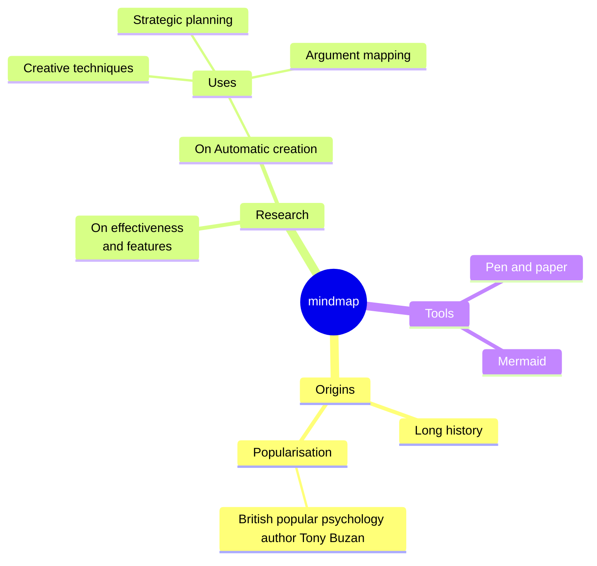
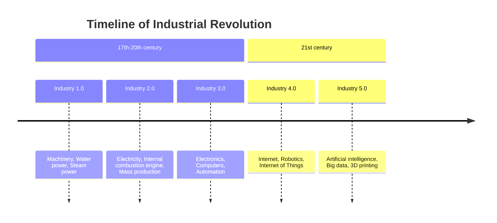

```mermaid
mindmap
  root((Central Idea))
    Origin
      Topic One
      Topic Two
    Research
      Data A
      Data B
```

```mermaid
mindmap
  root((mindmap))
    Origins
      Long history
      ::icon(fa fa-book)
      Popularisation
        British popular psychology author Tony Buzan
    Research
      On effectiveness<br/>and features
      On Automatic creation
        Uses
            Creative techniques
            Strategic planning
            Argument mapping
    Tools
      Pen and paper
      Mermaid
```

```mermaid
timeline
    title Timeline of Industrial Revolution
    section 17th-20th century
        Industry 1.0 : Machinery, Water power, Steam <br>power
        Industry 2.0 : Electricity, Internal combustion engine, Mass production
        Industry 3.0 : Electronics, Computers, Automation
    section 21st century
        Industry 4.0 : Internet, Robotics, Internet of Things
        Industry 5.0 : Artificial intelligence, Big data, 3D printing

```
