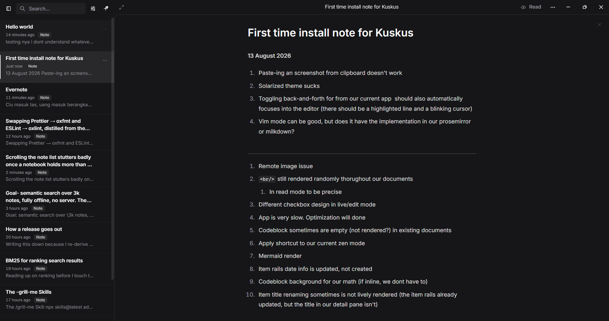
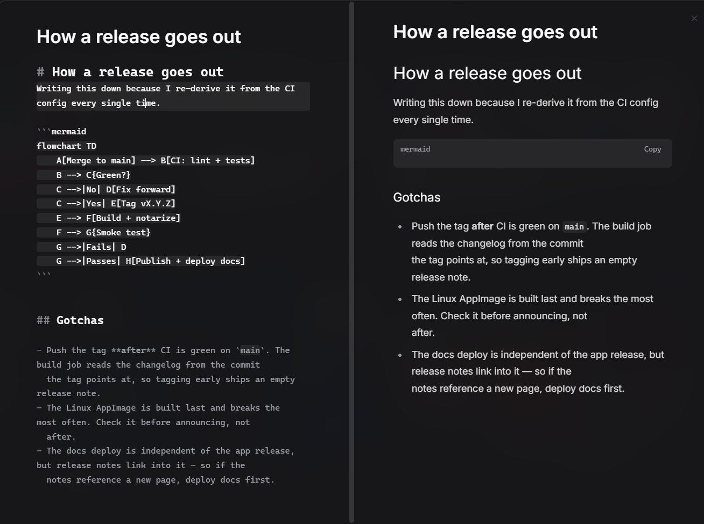
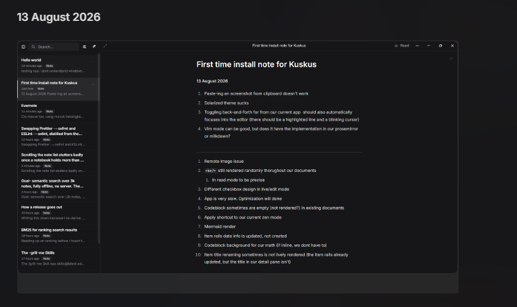

**13 August 2026**

1. Paste-ing an screenshot from clipboard doesn't work
2. Solarized theme sucks
3. Toggling back-and-forth for from our current app  should also automatically focuses into the editor (there should be a highlighted line and a blinking cursor)
4. Vim mode can be good, but does it have the implementation in our prosemirror or milkdown?

***

1. Remote image issue
   1.  I think we should also be able to render remote image
2. ` ` still rendered randomly thorughout our documents 
   1. In read mode to be precise
3. Different checkbox design in live/edit mode
4. App is very slow. Optimization is needed but not desperately
   1. In-app speed is everything, smooth interaction is what we need
5. Codeblock sometimes are empty (not rendered?) in existing documents
6. Apply shortcut to our current zen mode
7. Mermaid render
8. Item rails date info is updated, not created
9. Codeblock background for our math (if inline, we dont have to)
10. Item title renaming sometimes is not lively rendered (the item rails already updated, but the title in our detail pane isn't)
11. Image interaction? 
12. Sonner design

***

I dont know what should i integrate right now

text on image should be smaller and is less 'distracting' than the actual regular text that we have. centering it might be good also

* Make on boarding feature way less boring right now
