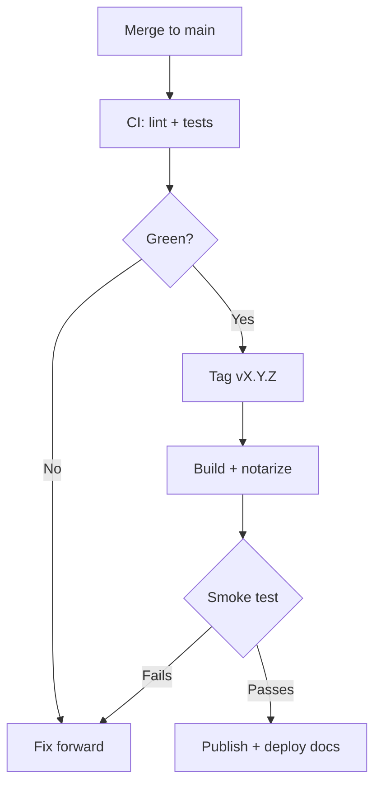

# How a release goes out
Writing this down because I re-derive it from the CI config every single time.

## Gotchas

- Push the tag **after** CI is green on `main`. The build job reads the changelog from the commit
  the tag points at, so tagging early ships an empty release note.
- The Linux AppImage is built last and breaks the most often. Check it before announcing, not
  after.
- The docs deploy is independent of the app release, but release notes link into it — so if the
  notes reference a new page, deploy docs first.
