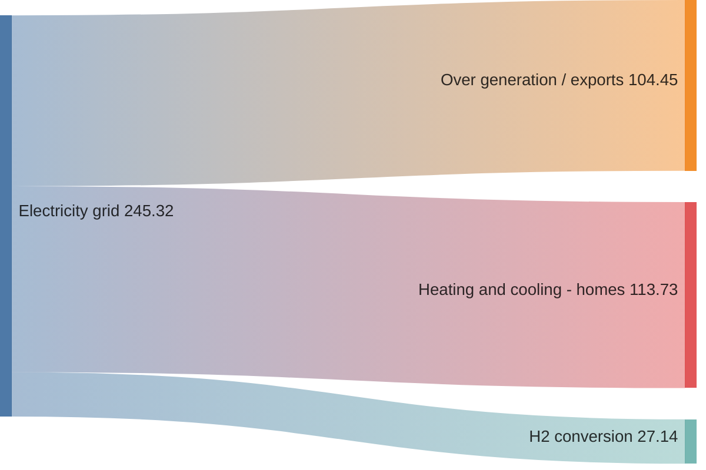
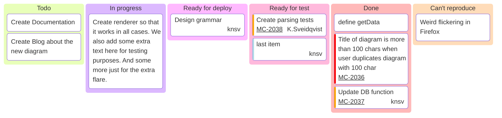
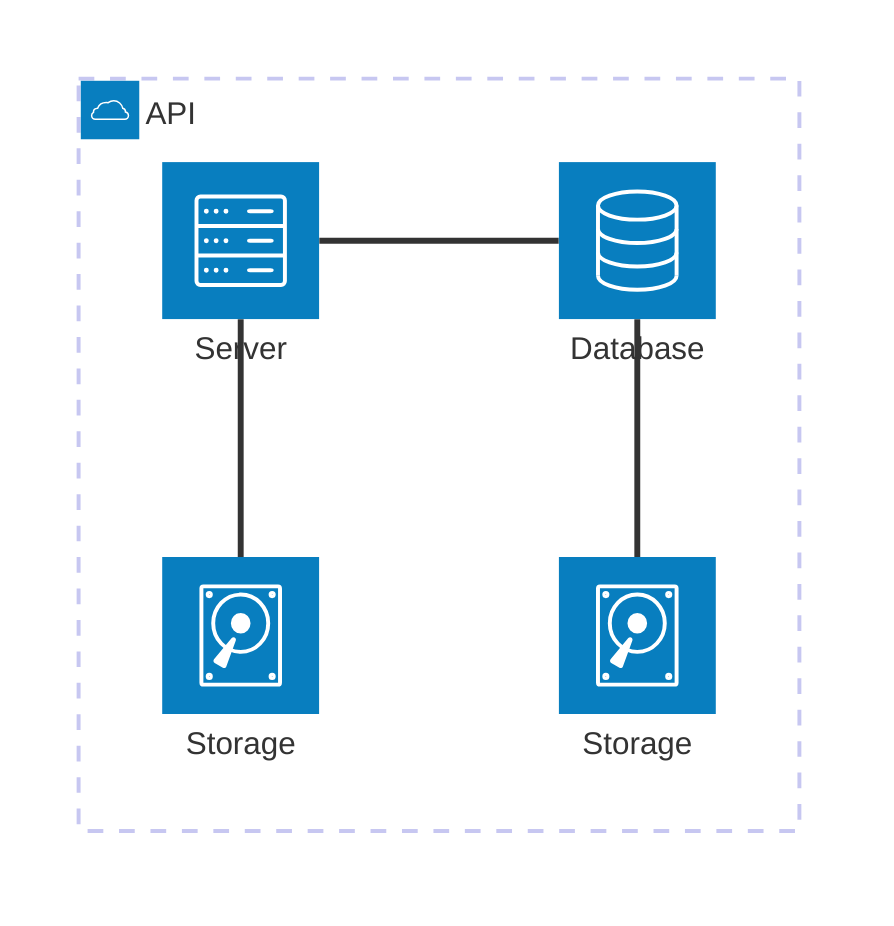
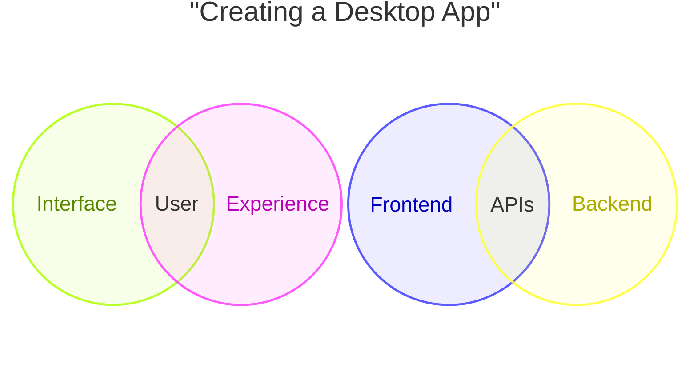

## Sankey graph 

```mermaid
sankey

%% source,target,value
Electricity grid,Over generation / exports,104.453
Electricity grid,Heating and cooling - homes,113.726
Electricity grid,H2 conversion,27.14

```

## Kanban

```mermaid
---
config:
  kanban:
    ticketBaseUrl: 'https://mermaidchart.atlassian.net/browse/#TICKET#'
---
kanban
  Todo
    [Create Documentation]
    docs[Create Blog about the new diagram]
  [In progress]
    id6[Create renderer so that it works in all cases. We also add some extra text here for testing purposes. And some more just for the extra flare.]
  id9[Ready for deploy]
    id8[Design grammar]@{ assigned: 'knsv' }
  id10[Ready for test]
    id4[Create parsing tests]@{ ticket: MC-2038, assigned: 'K.Sveidqvist', priority: 'High' }
    id66[last item]@{ priority: 'Very Low', assigned: 'knsv' }
  id11[Done]
    id5[define getData]
    id2[Title of diagram is more than 100 chars when user duplicates diagram with 100 char]@{ ticket: MC-2036, priority: 'Very High'}
    id3[Update DB function]@{ ticket: MC-2037, assigned: knsv, priority: 'High' }

  id12[Can't reproduce]
    id3[Weird flickering in Firefox]

```

## Architecture

```mermaid
architecture-beta
    group api(cloud)[API]

    service db(database)[Database] in api
    service disk1(disk)[Storage] in api
    service disk2(disk)[Storage] in api
    service server(server)[Server] in api

    db:L -- R:server
    disk1:T -- B:server
    disk2:T -- B:db

```

## Venn 

```mermaid
venn-beta
  title "Creating a Desktop App"
  set Frontend
  set Backend
  union Frontend,Backend["APIs"]

  set Interface
  set Experience
  union Interface,Experience["User"]
```
