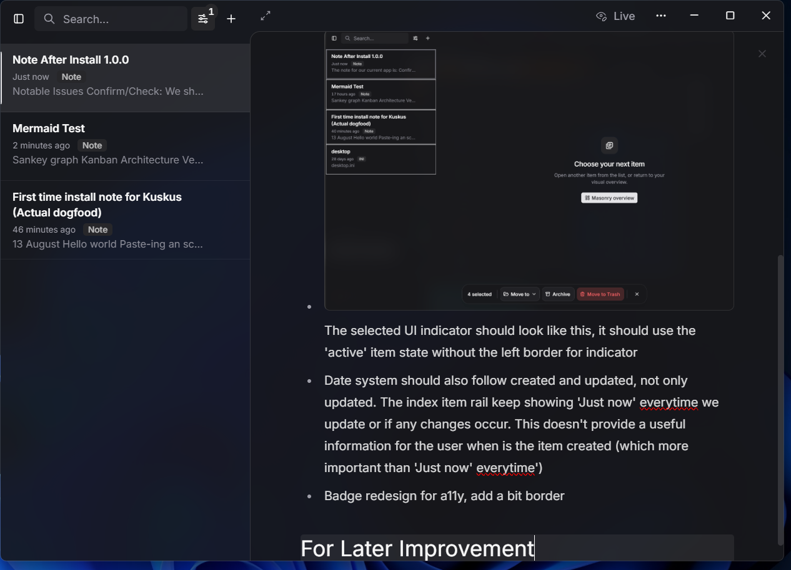

## **Fix** and **Confirm** these issues

* **Confirm/Check:** We should confirm the existing implementation about the image embedding feature. We should check how image is embedded and how it looks like in the Markdown source

* **Confirm/Check:** Scrolling through the main item visual rails is 'kind of' heavy. Is it normal because each note item is rendering 'markdown'? It happens in 100 notes, not after 1000

* Writing down markdown doesn't feel any different from this app to other writing app (Obsidian, Evernote)? 95% of the markdown writing part is basically functioning very well

***

* [ ] Integrate a performance measurement to understand how performant the current implementation is 

- [x] Right-clicking in our index item doesn't open the context menu. Right-clicking item in visual mode works and opens the context menu (but not in index mode)
- [x] Our checkbox is placement is has a bit offset to the top. Maybe shift it to the bottom by 1px
- [x] Cannot access developer tools  via `f12`
- [x] Zen mode key toggle doesn't works

* 
* [x] Date system should also follow created and updated, not only updated. The index item rail keep showing 'Just now' every time we update or if any changes occur. This doesn't provide a useful information for the user when is the item created (which more important than 'Just now' every time')

- [ ] Badge redesign for a11y, add a bit border (the badges are "Note", "Link", etc.). The badge should also in colours that is complement to our primary colour
- [x] `Ctrl + F` or find and replace functionality doesn't work in live and read mode. For Read mode, it should only Find (without the replace)
- [ ] When our notes it scrolled away, toggling from live mode to read mode behaves normally. But from read mode to live mode, we immediately scrolled to the beginning line and is prompted to write from the starting point of the document
- [ ] **Confirm/Check:** Is it true if the user will experience lag or slow downs when they open a big repository/vault for the first time? If yes, is it because the app is creating a new cache for the starter? If yes, the user should be informed via toast/Sonner would be good
- [x] Starting app speed is really good. Also, what happen if we open more than one App window? I tried that, but nothing happened. But what ***should*** happen
- [ ] **Confirm/Check:** In 'All Items' menu how are the items are loaded? The items are very resource intensive by rendering markdowns for each notes. What is the best way to load them?

* Also, is each of these note are rendered all the way through? For instance of the document can show thousands of words of many different heavy elements like code block, images and links. Are these rendered also even if the preview is very small and shows only the small part of the early part of the document? 

- Confirm/Check: Is 'blurring' features performant? For instance blurring the background in the dialog
- Why was my `%APPDATA%` has 3-4 GB in size? 
- Delay in writings. 
- Is toggling between the translucent activity will affect our performance on the same session?
  * Meaning, if I already have the translucent activated and use the app normally, I will have better performance than if I turn off the translucent but didn't restart the app. 
- For versioning, is it starting on 0.0.1 or 1.0.0? I think is the former choice
- Link detection can be flawed. For instance copy this to the quick composer `https://native-sdk.dev/` it won't be saved as a link. Instead it added a new note

* [x] There is some flickering in the code block that is rendered in the item rails. It flicker for every keystroke or mouse clicks. The code block flicker from empty code block, then the content appear for every event keyboard or mouse. We haven't confirmed it this only happens to code block or not

## Features For Later Improvement

* 

* [x] When the active cursor is at the bottom of the page when we continue write the document further than the height of the pane. It is very 'packed'  and is at the bottom of our screen need more space/room 

- [ ] What is the recommended settings for performance also for aesthetic? The user should also can picked which one suits their needs the best
- [x] Please integrate a feature for pin items? The goal of this feature is to provide user a way to put item on a 'watchlist', that they constantly looking up to or providing updates to
- [x] Renaming title for the focused detailed pane document via `f2`. Currently there is no quick access to rename the title of the document we're writing in. It should renaming should be in inline in our detail pane title header. But we now allow renaming via focusing an instance in our item rails and this is a **very good UX**

* [x] Opening an item navigates us into a detailed view. But the item rails on the left side is not scrolled to the selected item (instead it started from the top)

* [x] Terrible placement for the callout ("Unable to Complete Action. These items are already in Trash"). This should be in a Sonner 

- [x] Multi select in item rails is inaccessible via `shift + click`
