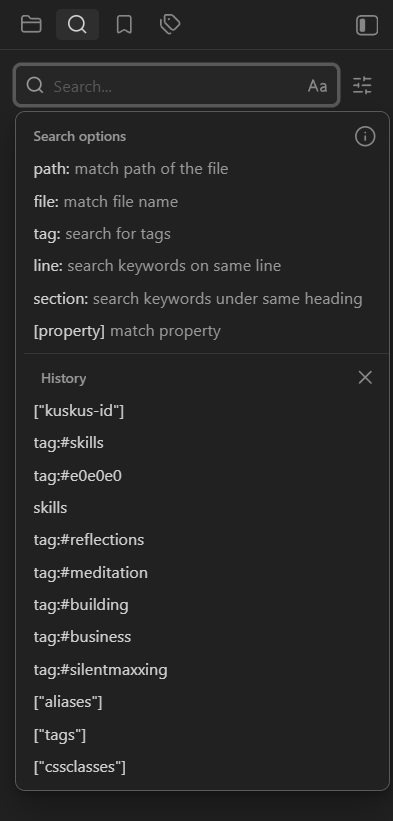
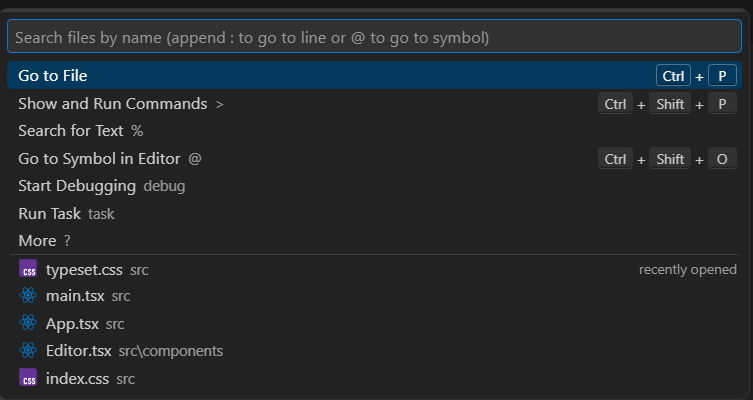

## findings

> Anything issues that is considered priority should be implemented soon to get ready for early release

### 13/09/2026
- Our current quick capturer, `ctrl + shift + space` needs to follow the current Window Material setting. Currently, it stays and always on

### 12/09/2026
- Brainstorm and grill more on the keyboard first support, especially on the main flow
- The status bar that contains the word and character counts should be also implemented in read mode
- Option for window material: add a sidebar only option for the translucency
- Extend simple feature: 
    - Reduced motion
    - A simple duplicate note feature
- Multiple item opened(?), tab style
  - Some users prefer their note taking app to be simpler, where they can focus on one note at a time. This feature should be put to optional and is toggleable
-  Command Pallete `ctrl + shift + p` use case: 
    1. Theme selector
    2. Dark/light theme toggle
    3. Open settings
    4. Insert today's date
    5. Toggle Window Material
    6. Toggle Vim
    7. Toggle Zen

### 11/09/2026
- The icon buttons (sort and filter button, new note button, and new item button) should be improved to show the 'lifted' state better
    - For instance, filter button shows a floating number on top of the icon, indicating the filter button state is 'lifted'
    - But showing the number on top of it interfere with out icon's visibility
- The 'External changes has been merge' notification occur, even though we're not changing anything externally. What happened?
- These things doesn't seem to show properly in live mode: 
    -  Remote images
        -  The images when examined/clicked in read mode, opened the page for us and turns our current app into a browser (and basically 'kill' the app, we opened a page and has no browser interactivity like back. This interaction also is unexpected)
    - Mermaid renderer. Live mode only shows the code
        - For mermaid, can we integrate a theme-based color?   
    - Math block or Katex also shows the code
- For the Vim's block caret should be in primary color instead of foreground 
- How is our current app is eating our resources (RAM)? How it works when we're using it or when idle? 
    - Can we benchmark it? The desired goal is 
- Opening a markdown file (.md) should upload the content immediately
- Question: Why toggling the checkbox (in read mode) trigger a scroll switch?  The app scrolled down
- Integrate a 'Copy file path' 

### 10/09/2026
- The main app's layout (overview) looks sucks. The action buttons is not highlighted, there is not true workflow that can be done only via keyboard
    - But we have two different main actions: `Add item` and `Add note`
    - For "**Add Note**" Maybe it's this: `ctrl + n` -> `Type a content` -> `Done`
- The floating sidebar should only occur in the smallest breakpoint
- In the narrowest breakpoint, it works flawlessly. But the chevron icon button should be changed to a hamburger buttons (stacked horizontal lines)
- Languages support: 
    - Vocabulary support in the to check typos
    - User should able to pick which languages that their content supports
- Separated font system for Note content. This one should be separated from the UI font and the code font (which is obvious)
    - Some user may prefer to have their content presented in serif font, while keeping the rest of the app the way it is (code still use the dedicated code font)
- For our current zen mode, always show the 'quit zen mode' button
- Setting still sucks, it should be integrated as a separate window like how obsidian does it, instead of doing it in dialog
- The slash menu still doesn't open, here's I found it
    - I'm in live mode, then I press `/`. Nothing happened. Is this expected?  
- The horizontal scrollbar in code block, still appears in the rails and overview card (we don't open in and is not in detail pane)
- Sidebar toggle doesn't works in when detail pane is opened

## need to be grilled
-  Our current search modal, should be a `find and create item` instead of search functionality.
- The actual search functionality should works like how Obsidian implemented it. We can keep the UI, don't need to scratch any design (just redirect it!)
    - Obsidian: 
    - VSCode 
- How should links be integrated in our app? 
    - Should links that is written in the YAML content provide a 'go to' interaction? 
        - What about live mode? 
- Table and images editing/writing experiences in live mode should be improved. The user should able to write table and images content expecting anything to break 
- Inline formatting when selecting texts *using cursor*
    - Why I need to explicitly says 'using cursor', because selecting it via Vim's visual mode to inline format doesn't seem to be *intuitive*
- Unfolding lines and trailing lines that shows our the indentation levels
    - The trailing lines features for nested content appear in our current source mode
    - We just want it in our current live mode
- In vim mode, should pressing `Ctrl + B` in note editing/writing bold the text? How should we work with other inline formatting while in Vim mode? How's obsidian implementing it? 
- Persistent caret positions when switching between modes
    - Let say we're in live mode and we select multiple lines, switching to read mode and then back to live mode, we should the previous selected texts. This interaction appears in Obsidian and it's good
- Language support(?)
---

### worth to think about
- Why is the current Vim skips some line when we navigate using `j` or `k` ? 
    - Some part or lines of the app is not accessible via the navigation, and the only way to solve this is to use Vim `/` search function to jump the cursor/caret into the specific part
    - Is this a known issue in Obsidian? What's the root cause about the 'jump'
- Split notes: dissect notes based on heading or hierarchy
    -  For example, I have three big points separated in three different headings. `Split notes` will split the content into three different notes
- Merge notes: more than 1 notes and merge it into a single notes. Basically the reverse feature of split notes
- Tasks counter: how many tasks (checkboxes) that we have in a single note and how many of them are done
- Outline navigations:
    - A clickable outline that helps us see the overview of our notes and directly navigates us towards it
- Notifications(?)
    - To show the historically view of our any toasts announcement
- Version history: for later improvement