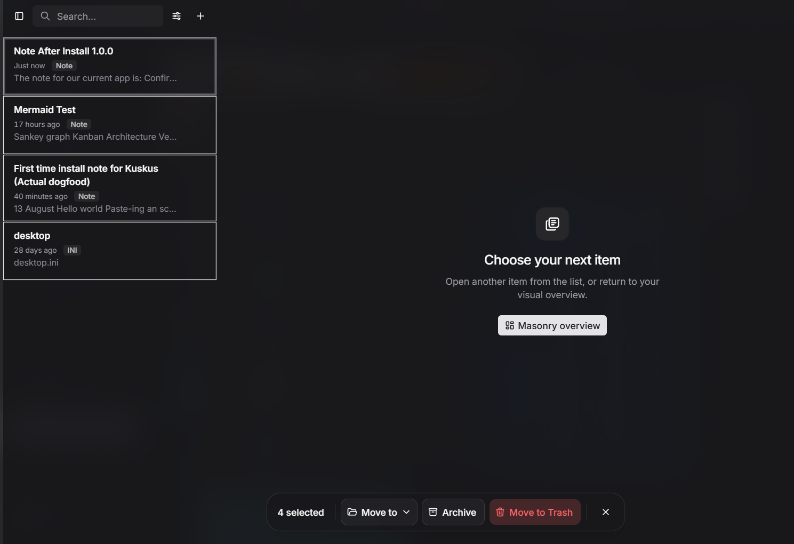
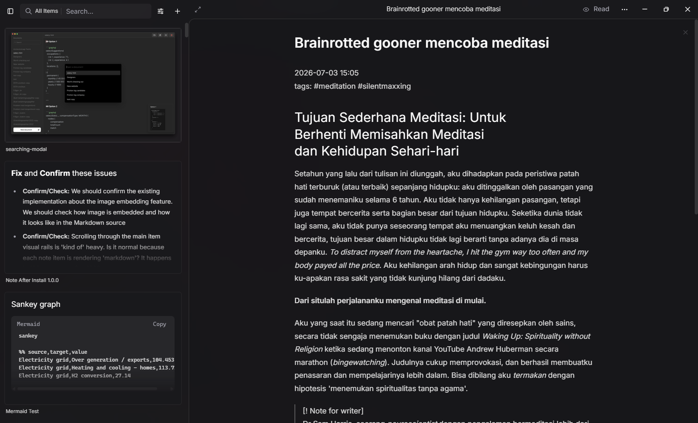
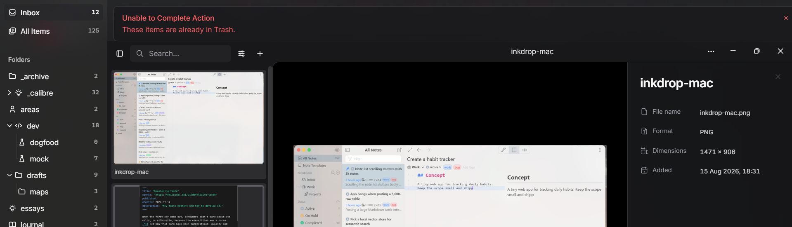
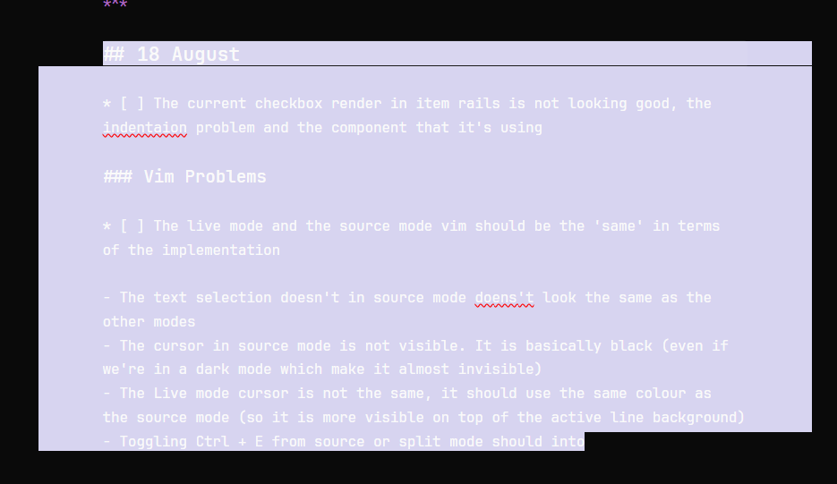

# 20 August

- Current vim mode status is very good and is positioned in the status bar
  - Maybe every `:` or `/` event should use a 'new input' that is positioned on the centre-top area of our current writing canvas (inspired by Neovim mode in VSCode and Vim mode in Zed)
- live mode and read mode has different scroll position.
  - If we're in a X scroll position in live mode, then we switch to read mode, it moves use to the new scroll position (Y).
  - And switching back to live mode will our scroll position to X (and switching to read mode will return us back again to Y scroll position)
- For indented instances in our bullet points, the new line is not indented and is wrapped like a normal text
  - Also show in the 'syntax highlighting' for our list hierarchy
    > Q: Is his our current syntax highlighting implementation is a custom or there's a convention from CodeMirror? How customizable is it?
  - This also occur in our other elements like tasks
    > Q: is CodeMirror has their own plugin or convention for handling this?
  - What's the line height? is this handled separately with our current `typeset.css`?
- There's a case that Vim mode is already activated but changing it to markdown source mode and  the editor isn't recognizing it.
  - Switching back the Vim mode again in the markdown source, then will trigger the Vim mode to be activated
- Managing attachments should be in a dropdown-like UI and interaction
- Findings: restarting the app while in split mode with vim mode activated, is mounted without the Vim activated. It should explicitly be re-toggled for the Vim to work again
- Improve the settings interface (make it feel better). Add font changes in settings

## Features

- [x] feature implementation: wrapped heading for better note organizations

# 19 August

- When using `/` command to  apply formatting, navigating with up and down arrow doesn't scroll the formatting options
- In source mode, how is our task and bullet points represented in  `*[ ]` and `*` instead of `- [ ]` and `-`
- Update the table design, add distinctive column borders and make the outer border for the table rounded
- Vim mode indicator should not be placed at the header, brainstorm with me on this one. Where conventionally it should be put?
- Move vim toggling to our settings, it shouldn't be that accessible to toggle from on and off

## For later

- Header toggling
- Currenlty, live writing mode should be considered as a immature feature since it is not yet ready for production
  - Code mirror implemenation for markdown writing should be our main functionality. Live mode should be put into a `beta` feature since it is very hard to integrate a 'good enough' user experience
- Redesign the search input bar for Vim implementation
- Check how the CodeMirror (source mode) vim design is implemented, and try to match that with our ProseMirror/Milkdown implementation (live mode)

# 13 August

- [ ] **Confirm/Check:** We should confirm the existing implementation about the image embedding feature. We should check how image is embedded and how it looks like in the Markdown source
- [x] **Confirm/Check:** Scrolling through the main item visual rails is 'kind of' heavy. Is it normal because each note item is rendering 'markdown'? It happens in 100 notes, not after 1000
- [x] Writing down markdown doesn't feel any different from this app to other writing app (Obsidian, Evernote)? 95% of the markdown writing part is basically functioning very well

# 14 August

- [x] Integrate a performance measurement to understand how performant the current implementation is
- [x] Right-clicking in our index item doesn't open the context menu. Right-clicking item in visual mode works and opens the context menu (but not in index mode)
- [x] Our checkbox is placement is has a bit offset to the top. Maybe shift it to the bottom by 1px
- [x] Cannot access developer tools  via `f12`
- [x] Zen mode key toggle doesn't works
- 
- [x] Date system should also follow created and updated, not only updated. The index item rail keep showing 'Just now' every time we update or if any changes occur. This doesn't provide a useful information for the user when is the item created (which more important than 'Just now' every time')

* [x] Badge redesign for a11y, add a bit border (the badges are "Note", "Link", etc.). The badge should also in colours that is complement to our primary colour
* [x] `Ctrl + F` or find and replace functionality doesn't work in live and read mode. For Read mode, it should only Find (without the replace)
* [x] When our notes it scrolled away, toggling from live mode to read mode behaves normally. But from read mode to live mode, we immediately scrolled to the beginning line and is prompted to write from the starting point of the document
* [x] **Confirm/Check:** Is it true if the user will experience lag or slow downs when they open a big repository/vault for the first time? If yes, is it because the app is creating a new cache for the starter? If yes, the user should be informed via toast/Sonner would be good
* [x] Starting app speed is really good. Also, what happen if we open more than one App window? I tried that, but nothing happened. But what ***should*** happen
* [x] **Confirm/Check:** In 'All Items' menu how are the items are loaded? The items are very resource intensive by rendering markdowns for each notes. What is the best way to load them?

- Also, is each of these note are rendered all the way through? For instance of the document can show thousands of lines of many different heavy elements like code block, images and links. Are these fully rendered also? Even if the preview is very small and shows only the early small part of the document (that is visible to the rail preview card)? 

- Confirm/Check: Is 'blurring' features performant? For instance blurring the background in the dialog

- Why was my `%APPDATA%` has 3-4 GB in size? 

- Delay in writings. 

- Is toggling between the translucent activity will affect our performance on the same session?
  - Meaning, if I already have the translucent activated and use the app normally, I will have better performance than if I turn off the translucent but didn't restart the app. 

- For versioning, is it starting on 0.0.1 or 1.0.0? I think is the former choice

- Link detection can be flawed. For instance copy this to the quick composer `https://native-sdk.dev/` it won't be saved as a link. Instead it added a new note

- [x] There is some flickering in the code block that is rendered in the item rails. It flicker for every keystroke or mouse clicks. The code block flicker from empty code block, then the content appear for every event keyboard or mouse. We haven't confirmed it this only happens to code block or not

# 15 August

- [x] When the active cursor is at the bottom of the page when we continue write the document further than the height of the pane. It is very 'packed'  and is at the bottom of our screen need more space/room 
- [ ] What is the recommended settings for performance also for aesthetic? The user should also can picked which one suits their needs the best
- [x] Please integrate a feature for pin items? The goal of this feature is to provide user a way to put item on a 'watchlist', that they constantly looking up to or providing updates to
- [x] Renaming title for the focused detailed pane document via `f2`. Currently there is no quick access to rename the title of the document we're writing in. It should renaming should be in inline in our detail pane title header. But we now allow renaming via focusing an instance in our item rails and this is a **very good UX**

- [x] Opening an item navigates us into a detailed view. But the item rails on the left side is not scrolled to the selected item (instead it started from the top)
  

- [x] Terrible placement for the callout ("Unable to Complete Action. These items are already in Trash"). This should be in a Sonner 

- [x] Multi select in item rails is inaccessible via `shift + click`

# 17 August

## Note After Installing 0.0.2

- [ ] **Fix:** Sidebar collapse shortcut doesn't work properly when detailed pane is opened
- [x] **Fix:** Theme for better contrast and a11y. Also for the markdown render theme
  - For instance, code block background; checkbox background and border are very hard to visually distinct 
- [x] **Polish**: Markdown render on the split node has a small-delay. Not to a point where it can be a constraint for the user, but just doesn't show attention to detail. It should be instantly rendered for every keystroke (like the original Codemirror implementation)
- [x] **Polish:** In read mode, we need a `selection -> Copy` interaction 
- [x] **Polish:** For the text selection, it should be coloured that aligns with our primary theme
- [x] **Polish**:  Markdown source theme is not very good, there should be a 'syntax highlighting' to improve the writing experiences
- [x] **Fix:** Checkbox clicking responsivity is different in live mode and read mode. Read mode takes a little bit delay. Live mode is instant. 
  - The instant responsivity also apply to `markdown source` and `split mode`
- [x] **Confirm**: How is pressing tab in writing down notes should behave? The current behaviour is the it shifting focus elements next to it (and for `shift + tab`, it changes to element previous to it). I believe this interaction is flawed and shouldn't be the 'right' behaviour
- [x] **Polish:** What is the background that we are using in when note is opened in a new tab? Our current default background for zen mode should be this one (the one when we opened a note in separate tab)
- [x] **Confirm:** Current the note in the rails are rendered item normal format (just regular text format, not markdown like previous implementation). Q: Why? How expensive it is to our performance if we bring back the markdown render? Also is it already 'optimized' by not rendering the full contents (and just render the earlier part of the document that is visible in the note card)? 
- [x] **Confirm:** Is it possible to test a mac build app in our current device (windows)?
- [x] **Polish:** Text strikethrough and de-contrast for the completed tasks item
- [ ] **Confirm:** If our current task element is way too scrolled to the bottom, in a long note for instance, toggling the task's checkbox result in shifted scrolled position. This interaction doesn't exist in live mode. 
- [x] **Confirm:** When we're scrolled in the middle of a long note, toggling `ctrl +e` results in 'layout shift', like a shifted up-and-down as we toggle the note control back-and-forth from read to live (and to read again). The layout shift ONLY occur when we go from read to live, nothing is shifted from live to read. Please check this issue and integrate a fix

# 18 August

- [ ] The current checkbox render in item rails is not looking good, the indentation problem and the component that it's using

## Vim Problems

- The live mode and the source mode vim should be the 'same' in terms of the implementation. 
- Try to have as minimum of 'custom implementation' that we built from scratch as possible. Use available solution like ProseMirror vim package
- The text selection doesn't in source mode doesn't look the same as the other modes
- YAML view in source mode shouldn't be highlighted as much as now (it is currently has bigger text sizes
- The cursor in source mode is not visible (the insert mode). It is basically black (even if we're in a dark mode which make it almost invisible)
- The Live mode cursor is not the same, it should use the same colour as the source mode (so it is more visible on top of the active line background)
- Toggling Ctrl + E from source or split mode should into
- How the text is selecting in source mode seems weird, it doesn't follow the actual text (the left side margin that is not part of the texts are also selected) 
