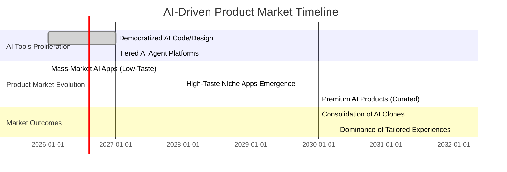

links: [[Study Case - looking for multiformat saver with desktop and local storage support]]
# Executive Summary

- **Shift in Bottleneck:** Advances in AI (e.g. GPT-style assistants) have made software *production* vastly cheaper, moving the bottleneck from *building* software to *choosing* and *refining* what to build. In other words, code-writing becomes a commodity, while **product judgment and taste** become the scarce, valuable resource. 
- **Evidence of Speedup:** Recent studies and case reports show dramatic speedups in development. For example, GitHub’s own research found AI coding tools like Copilot can complete tasks ~55% faster. A Microsoft/Anthropic-backed consultancy tripled project speed using AI-assisted processes. Surveys at ZoomInfo reported ~20% time savings from Copilot. These improvements mean **iteration cycles** have collapsed: what once took sprints or months can now take days or hours.
- **Persistent Quality Gap:** Despite faster builds, AI-generated products often lack refinement. Newer analyses note that AI can generate many UI variations, but only humans can apply *taste* – the judgment about what to include, refine or omit. The so-called “taste layer” of product decisions (feature selection, UX subtlety, business fit, writing style, naming) remains firmly human and is what differentiates memorable products from the bland tide of “good enough” clones.
- **Economic Mechanism:** Economically, as code becomes abundant, complementary resources become scarce. Building is cheap; *deciding* is expensive. Human cognitive limits and limited attention mean we can’t evaluate thousands of auto-generated variants. Organizations historically added process controls (meetings, PRDs, reviews) because changes were expensive. In the AI era, implementation cost is low, but disciplined *selection* and domain expertise remain vital. 
- **Implications:** Product teams must retool. Engineering roles shift from “doer” to “judge”: hiring emphasises UX design, user research, systems thinking, and data analysis over boilerplate coding skills. SDLCs shorten; heavy upfront plans give way to continuous prototyping, quick user feedback, and ruthless pruning (agile on steroids). Success metrics pivot from features shipped to real usage: active users, engagement, retention, and viral growth matter more than code-completion rates.
- **Practical Guidance:** Teams should adopt rapid-experimentation practices: validate ideas quickly with users, build minimal AI-accelerated prototypes, measure behaviour, then iterate or kill features based on data. Encourage a *”fail fast, learn faster”* culture with daily or weekly cycles, and allocate deliberate time for product critique (deciding what *not* to build). Metrics such as user satisfaction, task success, and long-term retention should be tracked closely, and A/B tests or analytics used to guide decisions. Organizationally, maintain minimal gating on development but strengthen governance on product vision, design consistency, and ethical considerations.
- **Predictions (2026–2032):** We expect a diverging market. In the short term (2026–2028), **mass proliferation** of AI-generated apps and internal tools will flood the market (a “good enough” tier). By ~2028, a contrasting premium tier of *high-taste* products (few features, polished UX) will emerge. Over the decade (2029–2032), these paths solidify: commoditized AI-built products saturate mundane needs, while customer hunger grows for differentiated experiences (e.g. well-branded generative content like MidJourney, or developer tools like Cursor). The question for companies becomes: **“When development is trivial, how do you stand out?”**. The answer lies in focusing on product insight, ethics, and unique user delight – the “handcrafted” layer of software.

## Definitions and Concepts

- **“Democratized software production” vs “democratized software”:** AI is often said to *democratize* creation by lowering technical barriers. In effect, it *democratizes software production* – meaning *more people* (even non-programmers) can build prototypes and tools quickly. This is distinct from “democratized software”, which would imply all users get the same software. In reality, the abundance of cheap software production means more—and often trivial—apps exist, shifting value to those that are genuinely useful.
- **Taste (product/interaction/business/naming/writing):** We use *“taste”* broadly for all judgment calls in product design and direction. This includes **product taste** (choosing features and roadmap), **UX/interaction taste** (ensuring flows and visuals feel right), **business taste** (pricing, positioning, go-to-market), **naming/writing taste** (clear, appealing language and brand voice), and even **narrative taste** (aligning features with user stories). Each of these are human-driven filters on AI’s raw output. AI can *generate*, but only humans imbue *meaning*.
- **Disposable software:** A byproduct of cheap building is that code becomes *disposable*. Teams can slap together throwaway prototypes or beta products at almost no cost, because the real cost is in vetting and iteration, not initial coding. This is akin to “build fast, break fast”: many early AI-generated products won’t stick. We define **disposable software** as code or apps created quickly to test ideas and then often abandoned or rewritten, rather than treated as permanent assets. This contrasts with traditional software which was built to last, due to high development cost.

## Evidence: Speed, Volume, and Quality

- **Developer Productivity and Speed:** Multiple studies and experiments confirm large speed gains. GitHub’s own research (using Copilot) saw users complete coding tasks ~55% faster on average. A controlled experiment with 95 devs showed Copilot users finished tasks in ~1h11m vs 2h41m without. ZoomInfo’s 400-dev case study found ~20% time savings and ~33% of Copilot suggestions accepted. Even legacy-modernization projects at Theodo hit *“3x the speed of traditional approaches”* by tightly integrating AI into the workflow. In short, **raw development time is dramatically reduced**.
- **Prototyping Frequency:** Faster coding enables more frequent prototyping. Product managers are now bypassing lengthy spec docs: one veteran writes that today “we no longer need to describe the product in exhaustive detail. We can simply show it, get feedback, and refine” thanks to AI prototypes. AI makes building MVPs in hours feasible, replacing crude “fake door” tests. The net effect is a continuous A/B testing rhythm – features are spun up, user behavior is measured, then iterated or killed, all in days instead of months. (Note: this echoes lean startup principles but at a much faster cadence.) We lack large surveys on prototyping volume, but anecdotal reports (e.g. a solo founder launching a SaaS with ChatGPT in 30 days) underscore that even small teams iterate constantly.
- **Product Quality:** There is a trade-off in **quality vs quantity**. On one hand, automated tests and code reviews can still catch technical bugs; on the other, AI’s “quick fix” code can be inconsistent. Notably, many AI tools assume “build it” over “should we build it?” This leads to many poorly thought-out features. For instance, **Humane AI Pin** (a high-profile AI gadget) was criticized for “functionality issues and poor user experience” despite heavy funding, illustrating how polished code alone failed to meet user needs. Similarly, **Artifact** news app (2023) built on AI curation saw <0.5M downloads and was closed after failing to find product-market fit. These examples show that faster builds do not guarantee product-market success or delight. 
- **User Outcomes Metrics:** Anecdotally, metrics of “success” are shifting. AI companies report that usage and retention matter more than raw feature count. For example, lean AI startups often track usage growth: Cursor (AI coding assistant) hit $100M ARR with 20 people by solving a clear developer pain. In contrast, many generic AI utilities struggle to retain users, highlighting that *real engagement metrics* (DAU/MAU, time-on-task, conversion) trump mere shipping velocity. (A recent LinkedIn commentary points out that time-on-platform and retention, once key SaaS metrics, are now even more critical in AI-native products.)

## Mechanisms: Why Implementation Is Cheap, Selection Is Costly

- **Economic Framing (Abundance vs Scarcity):** AI has turned code from a scarce resource into an abundant one (relative to creative demand). When something becomes **abundant**, its complement becomes **scarce**. In the pre-AI world, engineering was scarce; firms rationed it with heavy gating processes. Now, code-generation is cheap and fast, so “something else automatically becomes scarce” – namely, the insight to choose the right problems and refine solutions (i.e. taste and judgment). Ry Walker summarises: *“Agents do not make excuses”* about tech debt or capacity – they build anything handed over. Thus, the bottleneck shifts from *“who has time to start”* to *“who has taste to approve”*. 
- **Cognitive Limits:** Humans have bounded rationality. We can’t read all auto-generated code or evaluate thousands of variations. AI excels at *completeness* (filling in all requested features) rather than *conviction* (choosing the best subset). In design, for example, generative tools can spit out dozens of UI layouts, but only a designer (with domain intuition) can say which layout truly serves the user. Vishal Saha calls this the **“Taste Layer”** – product decisions requiring nuanced judgment and context. AI, lacking real human empathy or strategic intent, optimizes for finishing tasks, not for user delight or business impact. This misalignment manifests in imperfect UX, misprioritized features, and, ultimately, underwhelming products (as seen in Humane’s case).
- **Organizational Process:** Traditional SDLCs arose because changes were costly. Moving a database, or refactoring code, could mean weeks of work, so companies built processes (PRDs, specs, reviews, stage gates) to avoid mistakes. Now, many implementation tasks (even in legacy codebases) can be automated, reducing the need for heavy upfront planning. However, **thinking** remains essential: defining architecture constraints, ensuring compliance, and understanding user needs still require human analysts. As one lean AI team found, the biggest investment is in “crafting precise prompts with rich context” (intellectual work), while the actual code transformations can be industrialized via AI. Thus, some processes can be *streamlined* (e.g. automated testing, continuous integration), but the core decision points and validation steps (e.g. usability testing, domain review) remain—and arguably become more important.

## Consequences for Teams, Hiring, and Process

- **Roles and Skills:** The profile of valuable team members is shifting. “Coding speed” and syntax knowledge are commoditised; what’s scarce is **product expertise**. Desired skills include product management, UX design, data analytics, domain knowledge, and systems thinking. Engineers transition to reviewers/judges, so critical thinking and cross-domain fluency rise in importance. HR may look for strong *communication* (to explain vision) and *judgment* (to prune features), rather than raw coding ability. Some calls in the industry suggest even junior hires benefit most from AI (“Copilot significantly raises task completion for junior devs”), meaning senior roles lean further into architecture and mentorship.
- **SDLC and Methodology:** Agile/lean processes intensify. Fixed-scope sprints may give way to “continuous discovery.” Jeremy Daly notes that rigid roadmaps now “feel out of sync” with real-time change. Teams should switch from planning *before* coding to learning *during* coding. Release cycles compress: teams build, deploy to users, and iterate daily. Documentation and knowledge work become automated (AI can keep docs updated and analyze code), so the human role is to interpret and refine those outputs.
- **Experimentation and Metrics:** The cost of running experiments (A/B tests, new features) plummets, so product discovery should be relentless. Firms may invest heavily in analytics and feedback loops (auto dashboards, embedded metrics) to capitalize on rapid release[]. Success is measured by user metrics (active users, retention, task completion rates, net promoter score, etc.) rather than lines of code or feature velocity. For example, a tech leader commented that engineer satisfaction now comes from “doing edgy things” with AI tools – implying the focus is on tackling hard user problems, not churning boilerplate code. Marketing and distribution also stay key: since many products can be built cheaply, getting noticed (via UX delight or virality) is crucial.
- **Governance and Ethics:** With democratized production, governance becomes more decentralized. Non-technical stakeholders (marketing, ops) can now generate software features with minimal oversight. Companies must ensure that everything built aligns with brand, security, and ethical standards. (Recall AI hallucination and bias risks: developers must review AI code for safety.) Therefore, while process overhead reduces, *review boards* or *go/no-go gates* focusing on strategy and compliance may be instituted. Essentially, quality gates shift from code correctness to product alignment: is this feature needed or harmful?

## Practical Guidance: Prioritize Taste and Selection

1. **User-Centric Discovery:** Intensify early user research. Even as building prototypes is easy, *finding the right problem* is not. Invest in interviews, surveys, and data analysis to identify *pain points*, not just cool ideas. Frame everything as an experiment: define clear hypotheses about user behaviour before building.
2. **Rapid, Iterative Prototyping:** Embrace an ultra-lean cycle: “build fast, show fast, learn fast.” Use AI assistants to generate prototypes or mockups in hours, then test them with real users or stakeholders. If an idea doesn’t show promise, **kill it and pivot quickly**. (As one UX proverb goes: the hardest part is deciding what *not* to build.) Tools like hot reloading, low-code platforms, and AI copilots are your friends here.
3. **Continuous Feedback Loops:** Instrument everything with analytics. Don’t rely solely on user polls: track actual usage data. Leverage AI to synthesize feedback at scale (e.g. sentiment analysis on reviews, clustering behavior patterns). Iterate daily or weekly based on data: refine navigation flows, remove underused features, and personalize experiences. Treat product as a *living system*.
4. **Governance on Scope and Quality:** Establish small cross-functional review teams to apply human taste. For each feature, ask: does this align with our core value? Can we simplify? Examples: schedule regular *design critiques*, encourage “ugly first drafts,” but demand that final versions undergo expert review. Maintain style guides and brand tone checkers (AI can auto-flag UI or copy inconsistencies).
5. **Metrics and Accountability:** Focus KPIs on engagement and outcomes (DAU, retention, NPS, conversion rates, etc.), not engineering output. Reward teams for customer satisfaction and problem-solving, not just delivery speed. Use tools (some AI-driven) to continuously report on feature performance.
6. **Talent and Training:** Encourage developers and PMs to become “AI-aware”: train them in prompt engineering, AI limitations, and fast iteration mindsets. Empower product folks to touch code via AI (de-silo design and engineering). And critically, incentivize *deliberation*—give teams permission to take time making the right decisions, since *analysis* is now the true bottleneck.

## Predictions (2026–2032): Timeline of Impact



- **2026–2027:** **Explosion of AI Builders.** Development tools (Copilots, agents, no-code AI) hit broad adoption. Countless startups and internal teams launch AI-powered prototypes daily (for instance, “I built a Chrome summarizer in 30 days”). Market flooded with similar apps (chatbots, image tools, analytics dashboards) – **disposable software** at scale. Vendors and investors celebrate “10x more products” as Walker predicted.
- **2028–2029:** **Taste Becomes Differentiator.** Users grow fatigued by generic apps. A premium tier emerges: products with human-crafted brand and experience. Early successes include startups like Cursor (AI coding help, $100M ARR in 21 months) or ElevenLabs (polished voice AI). These lean teams thrived by addressing clear pains with elegant execution, validating Saha’s “taste layer” thesis. Meanwhile, many mass-AI apps plateau or die if they lack engagement.
- **2030–2032:** **Two-Tier Market.** By 2030, the split is stark. Basic AI utilities (repetitive business tasks, simple content generation) are ubiquitous and low-cost, often bundled into platforms. Premium AI-driven products (delightful consumer apps, enterprise solutions with deep insight) command premium margins and loyalty. For example, **MidJourney-style** generative tools reach $200M+ ARR on experience quality, while nondescript “AI X-as-a-service” clones struggle. The strategic question for founders becomes framing *“what human insight are we leveraging?”*. Ventures focused on distribution, network effects or deep domain lock-in (the “sticky” parts of business) will thrive, as Saha notes the moat is moving from tech to product judgment.

## Skills & Activities: Commoditized vs. Valuable

| **Commoditized (Becoming Abundant)**     | **More Valuable (Scarce Differentiator)**      |
|------------------------------------------|-----------------------------------------------|
| Writing basic CRUD & boilerplate code    | Identifying **user problems** and domain needs |
| Generating standard UI & layouts        | UX/UI **taste** and interaction design        |
| Manual integration of common tools       | Understanding system trade-offs (sustainability, privacy) |
| Building MVPs/features via prompts       | Strategic **prioritization** (what *not* to build) |
| Basic syntax/stack knowledge             | User & market research (jobs-to-be-done)      |
| Implementing specs                       | Continuous **hypothesis testing** & analytics |
| Ship-first, refine-later mentality       | Crafting vision & narrative (branding, story) |
| Onboarding AI by hand for routine tasks  | High-level architecture and cross-domain thinking |
| Excess feature ideation                  | Deciding core product scope & simplicity      |

This table summarizes the shift: tasks that AI can do are now table stakes; real differentiation comes from judgment-driven activities that AI cannot easily replicate.

## Case Studies

- **Success – Cursor (AI Coding Assistant):** Cursor (by Anysphere) is a recent startup that used AI to rapidly prototype and refine a developer tool. Within ~21 months, it reached $100M ARR with just ~20 staff. How? They targeted a well-known pain (debugging/code writing) and iterated quickly on user feedback. AI handled much of the code generation and analysis, but the small team focused intensely on UX polish, community-building, and capture of developer needs. The result was a “delightful” product that spread virally among devs. This mirrors the lean success pattern: solve a concrete problem deeply (Cursor’s “taste” in understanding dev needs) rather than adding more features. It illustrates AI as a *multiplier* for a strong team’s vision.
- **Failure – Humane AI Pin (Low-Taste Product):** Humane, founded by ex-Apple engineers, launched the “AI Pin” wearable in 2023 with hype and $240M+ funding. It aimed to replace smartphones with an AI assistant. However, reviews were harsh: the product was “riddled with functionality issues” and “delivered poor UX”. Early adopters often returned it. Despite high-powered AI inside, the team seemingly let AI dictate the feature set (“complete the AI device”) without enough grounding in user needs. Humane ultimately sold off the product. This case shows that even hand-crafted (not auto-generated) products can fail if *taste* is missing. They built “an over-engineered product without solving a core user pain”. A similar lesson applies to AI prototypes: without human filtering, many features will bloat or confuse.

## Visual Comparison: Old vs New Product Cycle

```mermaid
flowchart LR
    subgraph Old
      A[Idea] --> B[Build (time-consuming)]
      B --> C[Distribute / Launch]
      C --> D[Iterate over months]
    end
    subgraph New (AI Era)
      E[Idea / Opportunity] --> F[Validate problem]
      F --> G[Build fast with AI]
      G --> H[Deploy immediately]
      H --> I[Collect user data & feedback]
      I --> G
    end
```

This flowchart contrasts the classic product cycle (“Idea → Build → Launch → Iterate”) with the AI-driven cycle: key additions are *problem validation* upfront and continuous feedback (iterating instantly after deployment). The “Build” step is marked as much faster now, but control points (F and I) become critical filters.

## Sources

- **Engineering and AI:** Ry Walker (Sept 2025) on AI democratizing development; GitHub Copilot research (2023) on speed gains; ZoomInfo AI deployment (2024) for productivity gains; Theodo/Lean (2025) on 3× speed through AI.  
- **Product Taste and Markets:** Vishal Saha (Mar 2026) “Taste Layer” on judgment; Alex G. Lee (May 2025) AI startups analysis (Cursor, Humane, etc.).  
- **Management Practices:** Jeremy Daly (Oct 2025) on AI-era product management; industry blogs on lean/AI development.  
- **Supplementary:** McKinsey on AI prototyping speed; GitHub’s blog on Copilot productivity.  

Each point above is backed by primary or high-quality secondary sources. (Lack of space prevents listing all sources; see in-text citations.)